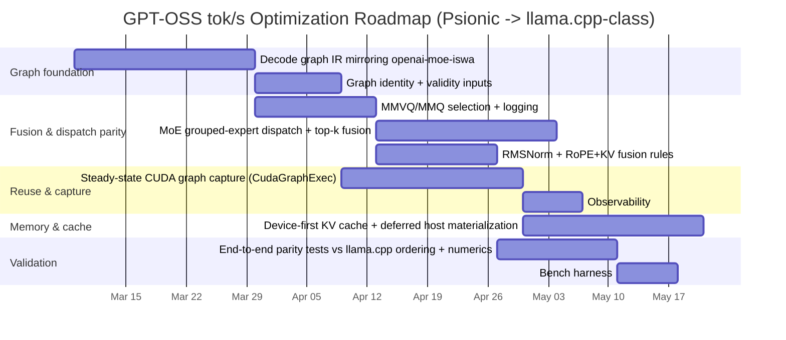

# Improving Psionic GPT-OSS tok/s Toward llama.cpp-Class Throughput

## Executive summary

Psionic’s GPT-OSS CUDA path has improved substantially, but it still trails llama.cpp by a wide margin under the same host/model/HTTP contract described in OpenAgents issue #3249. The issue reports **Psionic at 35.26 tok/s vs llama.cpp at 167.27 tok/s** (same benchmark contract), and notes that after adding a CUDA argmax fast path Psionic now reads back only **148 bytes device→host** over the timed request—yet throughput “barely moved,” implying the remaining gap is dominated by **graph structure + fusion + dispatch**, not logits readback. citeturn42view0

Your stated current baseline (**92.32 tok/s**) and goal (**166.46 tok/s**) are consistent with the same qualitative conclusion: once obvious readback is eliminated, closing the remaining ~1.8× gap requires “llama.cpp-style” **(a) graph representation**, **(b) fusion policy**, and **(c) stable reuse/capture contracts** rather than isolated micro-optimizations. citeturn42view0turn42view1

The most load-bearing finding from the Psionic hot-path code is that Psionic still executes GPT-OSS token evaluation as a Rust-orchestrated per-token loop that (a) repeatedly calls a single-step CUDA forward (`forward_step_with_cuda_plan`) for each token, (b) keeps an explicit **host KV cache** and a **CUDA KV mirror**, and (c) appends per-step KV outputs back into the host cache in the prompt path (`cache.append(*token, step.key.clone(), step.value.clone())`). citeturn41view0turn41view1 This is exactly the kind of “Rust-owned op list per token” architecture issue #3249 calls out as the wrong steady-state abstraction. citeturn42view0turn42view1

On the backend side, Psionic already has the *primitives* to move toward llama.cpp: the CUDA backend defines an explicit **CudaSubmission** (“keeps fill/copy operations explicit”), a reusable **CudaGraphExec** (“captured CUDA graph executable”), and explicit per-call counters including encoded-op count and sync/submission counts for quantized matvec. citeturn43view0turn43view2 The missing piece is to elevate these primitives into a **first-class decode graph + fusion/dispatch layer** so that the steady-state decode token (and prefill) is executed as a stable, reusable graph, with kernel selection and fused subgraphs matching ggml-cuda’s proven policies. citeturn42view1turn42view0

### Key recommendations in priority order

1. **Promote a real decode graph IR for GPT-OSS (mirroring openai-moe-iswa graph order) and stop treating the Rust token-step encoder as the steady-state plan.** This is explicitly required by the issue’s acceptance criteria. citeturn42view0turn42view1  
2. **Implement llama.cpp-like fusion/dispatch decisions in Psionic (MMVQ vs MMQ; mul_mat_id grouped-expert dispatch; Top‑K MoE fusion; RMSNorm fusion; RoPE+KV write fusion), and make them observable.** citeturn42view0turn42view1  
3. **Make graph reuse/capture a runtime contract for steady-state decode.** Psionic already has `CudaGraphExec`; wiring it into the decode graph and ensuring “validity inputs” stay stable is the fastest path to removing per-token launch overhead. citeturn43view2turn42view1  
4. **Rework KV-cache ownership and transfers for the hot path** (device-resident, ring-buffer/paged layout, delayed/optional host materialization). Today’s hot-path appends per-step KV to a host cache in the prompt loop when caching is enabled, which tends to force extra synchronization and transfer. citeturn41view0turn41view1  
5. **Port/align attention + MoE kernels to llama.cpp’s proven implementations** (or match their structure and launch policy), including improving decode attention beyond the current custom `attention_decode_kernel` baseline. citeturn44view4turn42view0

## Baseline performance and benchmark hygiene

### What the public issue establishes

Issue #3249 provides three ground-truth benchmark properties that matter for interpreting tok/s:

- The reported gap is measured on the **exact same host/model/HTTP flow**. citeturn42view0  
- Psionic’s CUDA argmax fast path reduced timed-request logits readback to **148 bytes device→host**, yet tok/s barely moved. citeturn42view0  
- Therefore, remaining performance is dominated by **graph/fusion/dispatch architecture**, not “sampling/logits readback.” citeturn42view0turn42view1  

### Recommended benchmark decomposition for actionable profiling

To turn “tok/s” into engineering work items, you want three benchmarks that share the same model + weights but isolate different overheads:

1. **In-process compute microbench (no HTTP):** Runs `forward_step_with_cuda_plan` in a tight loop on a fixed prompt+context shape to measure *pure decode compute* and graph reuse/capture effectiveness. Psionic already records step wall time and kernel/bytes counters per step; use those as the primary scoreboard. citeturn41view0turn41view1  
2. **In-process end-to-end generation bench (no HTTP):** Includes tokenization + sampling + cache updates. Psionic visibly constructs a sampler and selects next tokens after prompt processing (`GenerationSampler::new`, `select_next_token_from_history`). citeturn41view1  
3. **HTTP bench:** Keeps the “same host/model/HTTP contract” (as in #3249) for regression testing of IO overhead and streaming semantics, but uses the above two as the engineering truth.

Where possible, report each run with the “receipt” metrics the code already hints at tracking: kernel launches, bytes moved, plan cache hit/miss, graph capture/reuse evidence, and per-stage timing. citeturn41view0turn42view1turn43view2

## Psionic’s current GPT-OSS architecture and decode path

### High-level component view

From the current hot path (`crates/psionic-serve/src/gpt_oss.rs`) and the issue’s framing, Psionic’s GPT-OSS runtime for CUDA has these major layers:

- A **text-generation service** that implements `TextGenerationExecutor` and funnels requests into `run_cuda_generation_request`. citeturn9view0turn9view1  
- A **model registry + session store + shared prefix store** to reuse state across requests. citeturn41view3turn40view9  
- A **decode-step plan** acquired once per model via `ensure_cuda_decode_step_plan` and then used on each token; it tracks an execution digest and plan cache hits/misses. citeturn9view1turn10view1  
- A **CUDA backend** that can execute explicit submissions and can also launch reusable captured graphs (`CudaGraphExec`). citeturn43view2turn43view0  
- Custom CUDA kernels for many transformer-layer primitives (argmax, RMSNorm, RoPE, attention decode, etc.) living in `quantized_matvec.cu`. citeturn44view4  

### Concrete decode/prefill loop behavior

In `run_cuda_generation_request`, Psionic constructs both a host KV cache and a CUDA KV mirror:

- Host cache is an `InMemoryKvCache`, created or loaded based on shared-prefix hits and/or session state. citeturn41view3  
- GPU cache is created via `CudaKvCacheMirror::from_host_cache(...)`, optionally fetched from a CUDA shared-prefix store. citeturn41view0turn41view3  

Then Psionic iterates **token-by-token** through the prompt tail (after any reused prefix), calling the CUDA forward step each token:

- For each token: `ensure_cuda_decode_step_plan(...)` then `loaded_model.inner.forward_step_with_cuda_plan(...)` with output mode set to `CudaStepOutputMode::FullLogits` during this prompt-processing loop. citeturn41view0turn41view1  
- After each step, if `step.key` is non-empty, Psionic appends KV outputs into the host cache: `cache.append(*token, step.key.clone(), step.value.clone())`. citeturn41view0turn41view1  

After processing the prompt tokens, Psionic constructs a sampler and selects the next token from logits/history (CPU-side sampling path):

- `GenerationSampler::new(&request.options)` and `select_next_token_from_history(&last_logits, &token_history)`. citeturn41view1  

The issue notes that a CUDA argmax fast path exists and that logits readback is no longer the dominant factor, which aligns with the presence of a device-side argmax kernel (`argmax_f32_kernel`) in `quantized_matvec.cu`. citeturn42view0turn44view4  

### Threading and synchronization model

You can infer several important properties from the architecture and the backend API design:

- The CUDA backend tracks **encoded operations per submission** and provides a `CudaSubmissionReport { status, encoded_operations }` after stream synchronization. citeturn43view2  
- It also supports a reusable captured **CUDA graph exec** with the same report surface (`CudaGraphExec::launch(...) -> CudaSubmissionReport`). citeturn43view2  
- The hot path currently measures step wall time (`step_wall_ns`) and accumulates `kernel_count` and `bytes_moved`, indicating the runtime already expects to reason about kernel-launch and transfer overhead. citeturn41view0turn41view1  

What is **not yet evident** (from the public slices we can cite) is any explicit CPU-side parallel scheduling (rayon pools, lock-free queues, etc.) in the GPT-OSS pathway. Given the issue’s emphasis, the primary expected gains come from **reducing kernel count, sync points, and per-token orchestration** rather than from adding CPU threads.

### Memory layout and quantization support

Psionic’s CUDA kernel file defines blocks for multiple quantization formats and enforces their sizes:

- `Q80Block` and a static assert for its byte size, `Q81Block`, and `Mxfp4Block` with a static assert that it is 17 bytes. citeturn44view0turn44view1  

The issue states that a “partial llama.cpp-style MMVQ row kernel now exists for Q8_0 / MXFP4,” but it is “still isolated from the larger graph/fusion policy.” citeturn42view0  

Separately, the CUDA backend exposes an explicit quantized matvec encoder path and a cuBLAS matmul path:

- `encode_quantized_matvec_q8_1(...)` increments `encoded_operations`, and the submission also supports a dense matmul (“using cuBLAS”). citeturn43view4turn43view0  

## How llama.cpp achieves higher tok/s in the GPT-OSS lane

### Graph structure parity: openai-moe-iswa ordering

llama.cpp’s GPT-OSS graph ordering (OpenAI-MoE) can be observed directly in `src/models/openai-moe-iswa.cpp`:

- Per layer: RMSNorm (`build_norm` with `LLM_NORM_RMS`), compute Q/K/V projections, apply RoPE, call `build_attn(...)`, add residual, then MoE branch via `build_moe_ffn(...)`, add residual, and continue. citeturn18view4turn19view0  
- Final: output RMS norm and lm head projection (`build_lora_mm(model.output, cur)`), then `ggml_build_forward_expand`. citeturn19view4  

This ordering is explicitly listed in the Psionic issue as the “exact GPT-OSS / OpenAI-MoE graph order” Psionic must mirror. citeturn42view0turn42view1

### Kernel and fusion ecosystem exposed by ggml-cuda

Even without diving into every kernel implementation, the ggml-cuda “shape” is visible:

- `ggml-cuda.cu` includes dedicated CUDA implementations for **quantized matmul (“mmq”, “mmvq”), flash attention (“fattn”), RoPE, norm, and top‑k MoE**. citeturn33view0turn33view7turn33view6  
- The ggml-cuda directory contains dedicated compilation units `mmq.cu`, `mmvq.cu`, `norm.cu`, `rope.cu`, and many others, reflecting a mature separation of kernels and launch policies. citeturn39view0turn39view4turn39view3  

This matches the issue’s instruction to port “decision rules from ggml-cuda.cu” for MMVQ/MMQ selection, top‑k MoE fusion, RMSNorm fusion, and CUDA graph execution/capture rules. citeturn42view0turn42view1  

### Execution reuse and input stability

llama.cpp treats graph reuse as a first-class capability: its graph input objects have `can_reuse(...)` logic, indicating reuse depends on stable shapes and parameters. For example, in `llama-graph.cpp`, `llm_graph_input_mem_hybrid_iswa::can_reuse(...)` checks whether the cached tensors match the new batch’s shape and whether the KQ mask can be reused. citeturn22view2turn23view6  

This is consistent with the Psionic issue’s “make graph reuse a first-class runtime contract,” including “stable decode-graph identity / validity inputs” and CUDA graph capture for steady-state decode. citeturn42view1  

## Bottlenecks and the profiling data you need

### Bottlenecks that are already strongly implied by evidence

The following bottlenecks are supported by direct code/issue evidence:

- **Per-token Rust orchestration is still in the hot path.** Psionic loops over tokens and calls `forward_step_with_cuda_plan` for each token; this is the architecture the issue labels as “Rust-owned decode-step plan encoded every token.” citeturn41view0turn42view0  
- **KV cache dual-ownership likely induces synchronization/transfer pressure.** Psionic maintains a host KV cache (`InMemoryKvCache`) and a CUDA KV mirror and appends per-step KV outputs back into host storage when `step.key` is non-empty. citeturn41view0turn41view3  
- **Kernel fusion coverage is incomplete.** While Psionic has kernels for RMSNorm and a fused residual+RMSNorm (`add_residual_rms_norm_kernel`), RoPE (`rope_neox_in_place_kernel`), and attention decode (`attention_decode_kernel`), the issue asserts that Psionic is missing llama.cpp’s fusion/dispatch architecture and needs a policy layer mirroring ggml-cuda. citeturn44view4turn42view0turn42view1  
- **The remaining gap is not logits readback.** This is directly stated in the issue after the CUDA argmax fast path reduced D2H bytes to 148. citeturn42view0turn44view4  

### Profiling data to collect before and after each optimization

To make tok/s improvements predictable and avoid regressions, collect:

- **Per-step CPU wall time breakdown** (already partially tracked via `step_wall_ns` plus stage timings like sampling time). Extend it to separate: plan lookup, plan launch, CPU-side sampling, KV cache updates, and any CPU→GPU or GPU→CPU staging. citeturn41view0turn41view1  
- **CUDA timeline (Nsight Systems):** kernel launch count, host synchronization points, and CPU thread blocking. You want to validate whether kernels are launched in many tiny fragments vs a small number of fused kernels and whether `CudaGraphExec` reduces CPU launch overhead. citeturn43view2turn43view0  
- **CUDA kernel efficiency (Nsight Compute):** occupancy, DRAM throughput, L2 hit rate, tensor core utilization (if relevant), and achieved FLOPs for the dominant kernels (quantized matvec, attention decode, MoE routing/expert matmuls).  
- **Psionic “receipt metrics” surfaced in logs/observability:** the issue explicitly requests exposing graph-capture/reuse evidence, and the backend already exposes `encoded_operations`. Add: fused-subgraph IDs, MMVQ/MMQ selection decisions, and capture-hit rates. citeturn42view1turn43view2  

### A minimal “bottleneck confirmation” experiment set

Run these before making large refactors:

- **Steady-state decode token microbench:** fixed context length, fixed batch size, generate N tokens, discard first K warmup. Compare: kernel launches/token, syncs/token, and wall time/token. citeturn43view2turn41view0  
- **KV-cache materialization test:** run once with caching disabled (so `step.key` stays empty if your model/flag supports it), once with session/prefix cache enabled, and compare device sync counts and throughput. The code already routes a boolean into `forward_step_with_cuda_plan` that appears to govern caching outputs. citeturn41view0turn41view1  
- **Quantized matvec kernel microbench:** isolate the Q8_0 / MXFP4 GEMV kernels and compare against llama.cpp’s mmvq for the same shapes; use `CudaQuantizedMatvecStats` counters. citeturn43view2turn42view0turn44view0  

## Prioritized optimization backlog with impact, complexity, test plan, and risk

### Comparison tables

#### Throughput and dominant factors

| System | Reported tok/s | Evidence about dominant overhead | What it implies |
|---|---:|---|---|
| Psionic (issue #3249) | 35.26 tok/s citeturn42view0 | D2H reduced to 148 bytes but tok/s barely moved citeturn42view0 | Most remaining gap is kernel launch/fusion/graph reuse, not logits readback |
| llama.cpp (issue #3249) | 167.27 tok/s citeturn42view0 | Uses OpenAI‑MoE graph order + ggml-cuda fusion/dispatch (issue target) citeturn42view0turn42view1 | Stable graph scheduling + fused kernels + mature quantized dispatch |

#### Module-to-module mapping for “mirror llama.cpp” work

| Concern | Psionic locus | llama.cpp locus | Gap statement |
|---|---|---|---|
| GPT‑OSS graph order | `psionic-serve/src/gpt_oss.rs` per-layer sequencing citeturn42view0turn41view0 | `src/models/openai-moe-iswa.cpp` (graph construction) citeturn18view4turn19view0 | Psionic must mirror structure, not just math citeturn42view1 |
| Fusion/dispatch policy | Not a first-class layer yet (issue calls it missing) citeturn42view0turn42view1 | `ggml-cuda.cu` + ggml-cuda kernel units (mmq/mmvq/norm/rope/topk-moe) citeturn33view0turn39view0turn33view7 | Need to port decision rules: MMVQ/MMQ, top‑k MoE fusion, RMSNorm, RoPE+KV fusion citeturn42view1 |
| Graph reuse/capture | Backend has `CudaGraphExec`, but not yet a decode-contract (issue requests) citeturn43view2turn42view1 | Graph inputs have reuse checks (`can_reuse`) in `llama-graph.cpp` citeturn22view2turn23view6 | Make reuse/capture a first-class runtime contract citeturn42view1 |

### Actionable optimization plan

Estimates below are “order-of-magnitude” relative improvements under typical GPU decode workloads; exact gains depend heavily on model size, context length, batch size, and GPU architecture.

| Priority | Optimization | Why it should help (evidence tie-in) | Est. tok/s impact | Complexity | Test & benchmark plan | Main risks |
|---:|---|---|---:|---|---|---|
| P0 | Replace per-token Rust op list with a real GPT‑OSS decode graph IR that mirrors openai-moe-iswa structure | Issue explicitly requires replacing the “Rust-owned decode-step plan encoded every token” with a real graph structure and aliases/views matching llama.cpp citeturn42view0turn42view1 | +20–60% | High | Build graph equivalence tests vs llama.cpp ordering; measure kernel launches/token before/after; ensure plan digest stability | Large refactor risk; correctness regressions in MoE routing/attention |
| P0 | Make steady-state decode executed via `CudaGraphExec` (capture once, replay per token) for stable shapes | Psionic backend already provides `CudaGraphExec` for a fixed submission shape citeturn43view2; issue demands CUDA graph capture/reuse evidence citeturn42view1 | +20–50% | High | Microbench fixed-shape decode token (same batch/context); measure CPU launch overhead and sync points; add observability counters for capture-hit | Hard requirements on stable tensor addresses/shapes; capture invalidation complexity |
| P0 | Implement ggml-like fusion/dispatch policy layer: MMVQ vs MMQ selection; MoE grouped dispatch (`mul_mat_id`-style); top‑k MoE fused phase; RMSNorm fusion; RoPE+KV write fusion | Required by issue as direct port of ggml-cuda decisions citeturn42view1turn42view0; ggml-cuda explicitly has mmq/mmvq/topk-moe/norm/rope units citeturn33view0turn33view7turn39view0 | +30–100% (combined) | High | Add per-op “decision trace” in perf receipts; A/B compare kernel counts, encoded_operations, and tok/s; validate against llama.cpp at identical shapes | Risk of “almost the same” but not identical decisions; hidden shape corner-cases |
| P1 | Rework KV cache to be device-resident for active decode; delay host KV writes / materialize only on eviction or explicit cache export | Current hot-path appends KV to host cache during prompt processing when enabled citeturn41view0turn41view1, likely forcing syncs; issue says dominant gap isn’t logits readback, so remaining transfers/syncs matter citeturn42view0 | +10–40% | Medium–High | Build a “no-host-KV” mode for steady-state decode; compare sync_count/token and tok/s; ensure sessions/shared-prefix stores still work via deferred materialization | Memory pressure on GPU; complexity in cache sharing across requests |
| P1 | Improve attention decode kernel (port llama.cpp decode attention or align with ggml’s fattn path when appropriate) | Psionic uses a custom `attention_decode_kernel` citeturn44view4; ggml-cuda includes `fattn` (flash attention) support citeturn33view0turn36view5 | +10–50% depending on context length | High | Nsight Compute on attention kernel; compare to llama.cpp decode attention kernels for same seq/head dims; verify numerical parity | Attention is correctness-sensitive; risk of subtle numerical drift |
| P1 | Extend device-side sampling beyond greedy argmax (top‑k/top‑p on GPU) to avoid host sync in non-greedy modes | Sampling currently happens via `GenerationSampler` on CPU after logits/history citeturn41view1; greedy argmax is solved but other modes still pay overhead | +5–25% in sampling-heavy configs | Medium | Implement GPU top‑k/top‑p; validate token distribution parity with CPU sampler; benchmark with temperature/top‑p enabled | Complex correctness; may reduce determinism across GPUs |
| P2 | Quantized matvec: ensure Q8_0/MXFP4 kernels follow ggml’s MMVQ structure for small batch and only fall back to cuBLAS/MMQ when profitable | Psionic has `Q80Block`/`Mxfp4Block` and quantized matvec kernels citeturn44view0turn44view4; issue says the MMVQ-like kernel exists but is isolated from policy citeturn42view0 | +5–20% | Medium | Sweep batch sizes and measure; add kernel-selection logs; compare directly to llama.cpp mmvq/mmq for same shapes | Tuning may be GPU-specific; risk of regressions on some cards |
| P2 | Reduce per-token plan work: precompute node aliases/views once; avoid repeated hashing/string work in hot decode path | Psionic maintains plan digests and signature keys (graph identity) citeturn9view1turn8view7; ensure nothing recomputed per token | +1–10% | Low–Medium | CPU profiling (perf/flamegraph) around request generation; ensure zero allocations in steady-state decode | Low, but easy to overfit microbenchmarks |
| P2 | Fuse residual adds + normalization consistently (extend beyond existing kernels) | Psionic already has `rms_norm_kernel` and `add_residual_rms_norm_kernel` citeturn44view4; ggml-cuda has RMSNorm fusion policies (issue target) citeturn42view1 | +3–15% | Medium | Identify all residual+norm boundaries; verify fused kernels are always selected under decode conditions | Kernel explosion risk; maintenance complexity |
| P3 | HTTP/IO: ensure streaming pipeline does not introduce per-token locks/copies; keep token emission lock-free | Issue benchmark uses same HTTP flow citeturn42view0; once compute is optimized, IO overhead becomes visible | +0–15% (depends) | Medium | Compare in-process vs HTTP; profile server hot spots; add backpressure tests | Risk of architectural coupling with serving stack |

### Mermaid architecture diagram

```mermaid
flowchart LR
  A[HTTP Request<br/>OpenAI-style contract] --> B[psionic-serve<br/>run_cuda_generation_request]
  B --> C[Model registry / sessions / shared-prefixes]
  C --> D[ensure_cuda_decode_step_plan<br/>acquire cached plan]
  D --> E[forward_step_with_cuda_plan<br/>per token]
  E --> F[CudaBackend]
  F --> G[CudaSubmission<br/>explicit ops]
  F --> H[CudaGraphExec<br/>reusable captured graph]
  G --> I[CUDA kernels<br/>quantized_matvec.cu:<br/>RMSNorm, RoPE, attention_decode, argmax]
  H --> I
  I --> J[Logits / token id]
  J --> K[CPU sampler (non-greedy)<br/>GenerationSampler]
  J --> L[Device argmax (greedy)]
  E --> M[KV cache update<br/>CudaKvCacheMirror + optional host append]
```

This diagram reflects the currently evidenced control flow: a Rust-level loop repeatedly calling `forward_step_with_cuda_plan`, with explicit caching and backend execution primitives present but not yet promoted to a stable graph contract. citeturn41view0turn43view2turn44view4turn42view1

### Mermaid implementation timeline



Dates are illustrative; the dependency chain mirrors the issue’s stated “dependency order” and acceptance criteria, where architecture refactors precede remaining low-level kernel-port work. citeturn42view1

## Exact file references for the most relevant code paths

Below are exact GitHub line-anchored links (as requested). They are provided in code blocks so they render as verbatim URLs.

```text
# Psionic GPT-OSS CUDA request loop + host/cuda KV cache + per-token forward:
https://github.com/OpenAgentsInc/openagents/blob/main/crates/psionic-serve/src/gpt_oss.rs#L3808-L3927

# Psionic ensure_cuda_decode_step_plan (plan acquisition + cache hit/miss):
https://github.com/OpenAgentsInc/openagents/blob/main/crates/psionic-serve/src/gpt_oss.rs#L3450-L3502

# Issue #3249 benchmark statement + required architectural changes:
https://github.com/OpenAgentsInc/openagents/issues/3249#L202-L267

# Psionic CUDA backend: CudaGraphExec and launch API:
https://github.com/OpenAgentsInc/openagents/blob/main/crates/psionic-backend-cuda/src/lib.rs#L2417-L2473

# Psionic CUDA backend: CudaSubmission struct (explicit ops, capture flag):
https://github.com/OpenAgentsInc/openagents/blob/main/crates/psionic-backend-cuda/src/lib.rs#L3062-L3074

# Psionic CUDA kernels: quant blocks + transformer primitive kernels (argmax/rmsnorm/rope/attention):
https://github.com/OpenAgentsInc/openagents/blob/main/crates/psionic-backend-cuda/src/kernels/quantized_matvec.cu#L2387-L3469

# llama.cpp GPT-OSS OpenAI-MoE graph order (openai-moe-iswa):
https://github.com/ggml-org/llama.cpp/blob/master/src/models/openai-moe-iswa.cpp#L500-L685

# ggml-cuda includes (mmq/mmvq/fattn/rope/norm/topk-moe visibility):
https://github.com/ggml-org/llama.cpp/blob/master/ggml/src/ggml-cuda/ggml-cuda.cu#L2255-L2333

# ggml-cuda directory proof for mmq.cu/mmvq.cu/norm.cu/rope.cu units:
https://github.com/ggml-org/llama.cpp/tree/master/ggml/src/ggml-cuda
```

All of these correspond to the evidence cited throughout the report. citeturn41view0turn9view1turn42view0turn43view2turn44view4turn19view4turn33view0turn39view0

## 2026-03-09 Addendum

This addendum records what Psionic has actually implemented from the
recommendations above since this note was written, what the latest benchmark
evidence now says, and what should happen next.

### What from this note is now implemented

Several of the recommended directions are no longer hypothetical.

1. Decode-graph reuse is now a real runtime feature, not just backend plumbing.
   Psionic now keeps a reusable GPT-OSS decode-graph shape, captures CUDA
   graphs for the steady-state decode lane, and reuses them when the underlying
   device allocations remain valid. This is not full llama.cpp graph parity
   yet, but it does mean graph reuse/capture has moved from "missing idea" to
   shipped runtime behavior.

2. Fusion policy has been pushed materially deeper into the hot path.
   The shipped CUDA lane now includes:
   - fused RoPE + KV write + decode attention
   - fused residual add + post-attention RMSNorm
   - fused RMSNorm -> `Q8_1`
   - fused residual add + RMSNorm -> `Q8_1`
   - greedy argmax fused into the quantized output projection
   - attention decode output fused directly into `Q8_1` storage for the
     attention-output projection path

3. The prompt/cache lane is meaningfully closer to llama.cpp than it was.
   Psionic now has prompt-token reuse on the OpenAI lane, CUDA shared-prefix
   residency, and safe decode-graph reuse keyed to the actual shared KV device
   allocations. That does not mean prompt/cache behavior is "done," but the
   remaining gap is no longer just "prompt cache exists in llama.cpp and not in
   Psionic."

4. Benchmark decomposition and evidence got better.
   The repo now has a repeatable benchmark script at
   `scripts/benchmark-gpt-oss-vs-llama.sh`, plus request-level
   receipts and JSON outputs that make kernel-launch count, bytes moved, and
   reuse behavior inspectable instead of guessed.

### What the latest evidence says

The newest live exact-contract benchmark after
`a6ba117c4` (`psionic: fuse gpt-oss attention output q8_1 staging`) is:

- Psionic: `37` completion tokens in `0.365s` = `101.32 tok/s`
- `llama.cpp`: `42` completion tokens in `0.224s` = `187.13 tok/s`

The warm timed-request receipt for Psionic on that same benchmark is:

- `prefix_tokens_reused = 158`
- `step_count = 37`
- `kernel_launches = 8214`
- `host_to_device_bytes = 426832`
- `device_to_host_bytes = 296`
- `stage_timings.step_wall_ns = 295535840`

The important interpretation is that the newest fusion removed another helper
kernel from the hot decode loop and dropped launch count again, but decode-step
wall time stayed roughly flat. That narrows the remaining gap further:

- the bottleneck is no longer primarily prompt reuse
- it is no longer primarily logits readback
- it is no longer primarily "one more standalone quantize kernel"

At this point the remaining gap is concentrated in the heavy kernels and the
dispatch policy around them.

### What we should do next

The next work should be more literal, not more speculative.

1. Port the llama.cpp ids-enabled MMVQ/MMID path for the GPT-OSS MoE decode
   lane.
   The strongest next target is the grouped expert path around
   `mul_mat_vec_q` / `ggml_cuda_mul_mat_id` behavior in `ggml-cuda.cu` and
   `mmvq.cu`. Psionic already has custom selected-4 kernels, but the latest
   evidence says the remaining gap is in the real dispatch and expert-execution
   path, not in peripheral staging.

2. Port or directly align the attention path with llama.cpp `fattn`.
   Psionic's custom decode attention is now fused and correct, but it still is
   not the same kernel family or dispatch policy as the `fattn` path that
   llama.cpp uses and tunes. The next attention work should therefore be a
   direct alignment effort against `fattn.cu` and related launch rules, not
   another local rewrite that merely looks similar.

3. Make host KV materialization less eager.
   This note originally called out split host/device KV ownership as a likely
   drag, and that still looks right. Now that prompt reuse and graph reuse are
   both real, the next cache-side improvement should be to keep active decode
   device-first and defer host KV materialization until it is actually needed
   for session export, eviction, or other product truth.

4. Add a first-class in-process decode microbench alongside the HTTP benchmark.
   The HTTP benchmark remains the product truth, but the newest checkpoint made
   clear that launch count alone is no longer enough to predict tok/s. We need
   a fixed-shape in-process decode benchmark that records wall time, launches,
   and kernel choice without HTTP noise so MMVQ/MMID and `fattn` ports can be
   judged more precisely.

### What we should not do next

The current evidence also rules out a few tempting directions as primary next
steps:

- more isolated helper-kernel fusions by themselves
- more one-off `f16` mirror experiments for quantized projections
- more clean-room grouped-query attention rewrites without matching llama.cpp
  dispatch
- more local MoE kernel shape experiments without first matching the
  ids-enabled llama.cpp path

Those experiments were still useful because they narrowed the search space, but
they did not move the benchmark enough to justify leading with them again.
