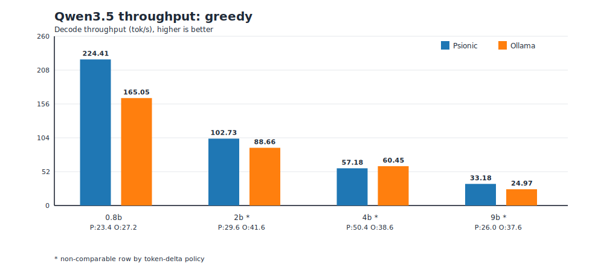
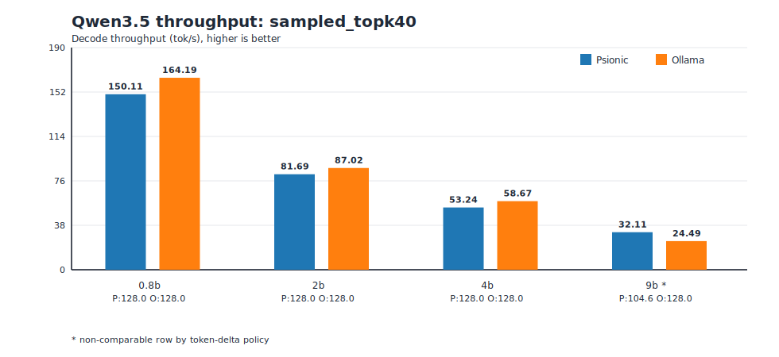
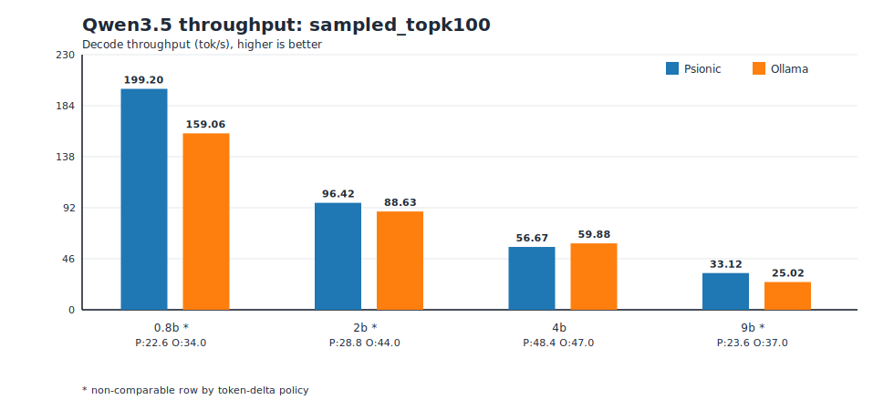
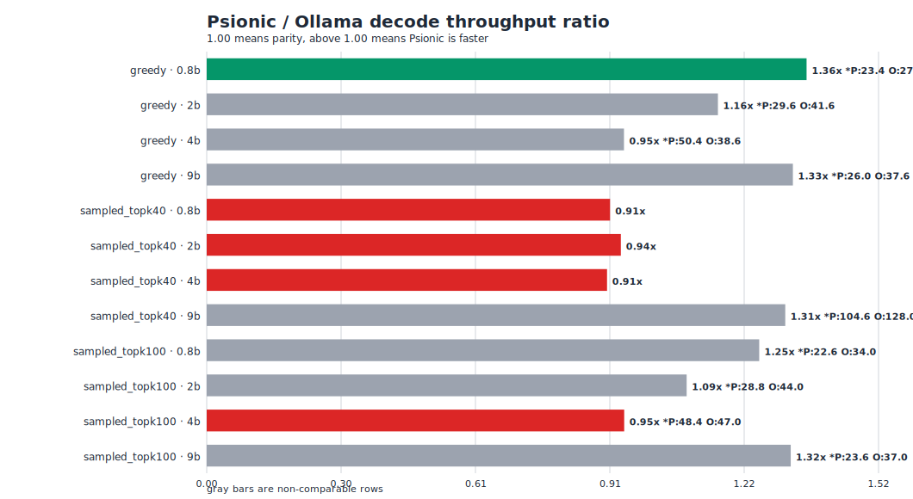

# Qwen3.5 Psionic vs Ollama Benchmark Summary (March 28, 2026)

This one-page summary is generated from:

- `fixtures/qwen35/benchmarks/qwen35_ollama_matrix_20260328_135540_rtx4070_laptop_8gb.json`
- run id: `20260328_135540_rtx4070_laptop_8gb`
- host: `NVIDIA GeForce RTX 4070 Laptop GPU` (8 GB), max power limit `90W`
- Psionic benchmark checkout commit: `9686fab0fc38a31856bf81677ba2f80a3ece65d2`
- Ollama version: `0.17.7`

## Executive Summary

- Comparable rows: `5` of `12` (token-delta thresholds: abs `16`, ratio `0.20`).
- Non-comparable rows: `7` of `12`.
- On comparable rows only, Psionic is ahead in `1` and behind in `4`.

## Comparable Rows

| Contract | Model | Psionic tok/s (mean±std) | Ollama tok/s (mean±std) | Ratio | Output tokens P/O |
| --- | --- | ---: | ---: | ---: | --- |
| `greedy` | `qwen3.5:0.8b` | 224.41±0.72 | 165.05±8.71 | 1.36x | 23.4/27.2 |
| `sampled_topk40` | `qwen3.5:0.8b` | 150.11±0.17 | 164.19±0.30 | 0.91x | 128.0/128.0 |
| `sampled_topk40` | `qwen3.5:2b` | 81.69±0.11 | 87.02±0.14 | 0.94x | 128.0/128.0 |
| `sampled_topk40` | `qwen3.5:4b` | 53.24±0.11 | 58.67±0.05 | 0.91x | 128.0/128.0 |
| `sampled_topk100` | `qwen3.5:4b` | 56.67±0.13 | 59.88±0.09 | 0.95x | 48.4/47.0 |

## Non-Comparable Rows

| Contract | Model | Classification reason | Psionic tokens | Ollama tokens |
| --- | --- | --- | ---: | ---: |
| `greedy` | `qwen3.5:2b` | token delta 12.00 (28.85%) exceeds thresholds | 29.6 | 41.6 |
| `greedy` | `qwen3.5:4b` | token delta 11.80 (23.41%) exceeds thresholds | 50.4 | 38.6 |
| `greedy` | `qwen3.5:9b` | token delta 11.60 (30.85%) exceeds thresholds | 26.0 | 37.6 |
| `sampled_topk40` | `qwen3.5:9b` | token delta 23.40 (18.28%) exceeds thresholds | 104.6 | 128.0 |
| `sampled_topk100` | `qwen3.5:0.8b` | token delta 11.40 (33.53%) exceeds thresholds | 22.6 | 34.0 |
| `sampled_topk100` | `qwen3.5:2b` | token delta 15.20 (34.55%) exceeds thresholds | 28.8 | 44.0 |
| `sampled_topk100` | `qwen3.5:9b` | token delta 13.40 (36.22%) exceeds thresholds | 23.6 | 37.0 |

## Code Changes and Why

- No new CUDA inference-kernel changes were introduced for this rerun.
- This rerun used the matrix evidence pipeline from commit
  `9686fab0fc38a31856bf81677ba2f80a3ece65d2` so every row captures per-repeat
  JSONL evidence, output-token counts, and comparability classification.
- This changes the reporting shape, not the decode algorithm.

## Graphs

### Throughput by contract

### Ratio overview

