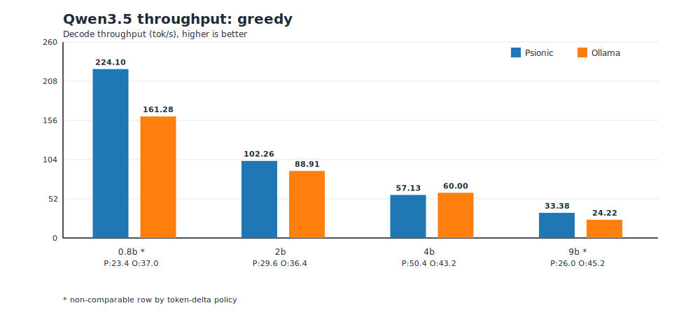
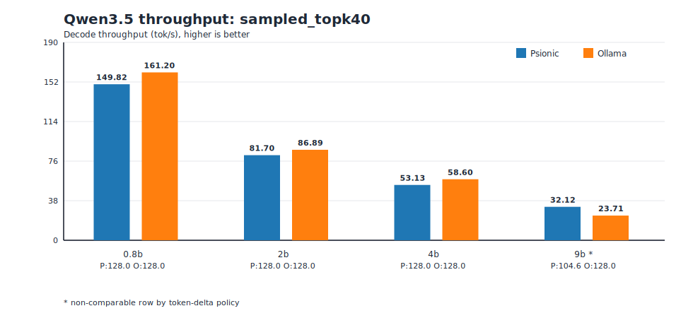
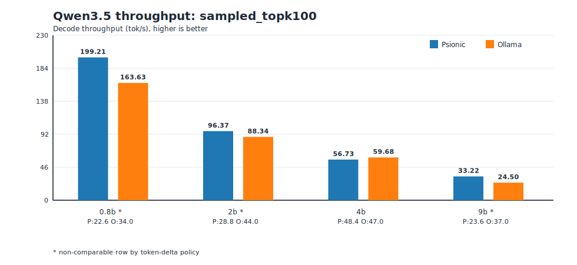
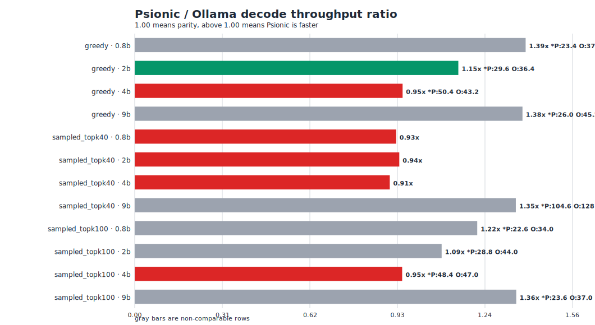

# Qwen3.5 Psionic vs Ollama Benchmark Summary (March 28, 2026)

This one-page summary is generated from:

- `fixtures/qwen35/benchmarks/qwen35_ollama_matrix_20260328_143727_rtx4070_laptop_8gb.json`
- run id: `20260328_143727_rtx4070_laptop_8gb`
- host: `NVIDIA GeForce RTX 4070 Laptop GPU` (8 GB), current power cap `55W` (max `90W`)
- Psionic benchmark checkout commit: `fe5d4bcd933ab9fa36ba1df4986b8d5ce8f25647`
- Ollama version: `0.17.7`
- pre-run GPU snapshot: `fixtures/qwen35/benchmarks/reports/qwen35_ollama_20260328_143727_rtx4070_8gb/nvidia_smi_pre_run.txt`

## Executive Summary

- Comparable rows: `6` of `12` (token-delta thresholds: abs `16`, ratio `0.20`).
- Non-comparable rows: `6` of `12`.
- On comparable rows only, Psionic is ahead in `1` and behind in `5`.

## Comparable Rows

| Contract | Model | Psionic tok/s (mean±std) | Ollama tok/s (mean±std) | Ratio | Output tokens P/O |
| --- | --- | ---: | ---: | ---: | --- |
| `greedy` | `qwen3.5:2b` | 102.26±0.34 | 88.91±0.54 | 1.15x | 29.6/36.4 |
| `greedy` | `qwen3.5:4b` | 57.13±0.19 | 60.00±0.18 | 0.95x | 50.4/43.2 |
| `sampled_topk40` | `qwen3.5:0.8b` | 149.82±0.16 | 161.20±1.96 | 0.93x | 128.0/128.0 |
| `sampled_topk40` | `qwen3.5:2b` | 81.70±0.05 | 86.89±0.19 | 0.94x | 128.0/128.0 |
| `sampled_topk40` | `qwen3.5:4b` | 53.13±0.03 | 58.60±0.08 | 0.91x | 128.0/128.0 |
| `sampled_topk100` | `qwen3.5:4b` | 56.73±0.11 | 59.68±0.16 | 0.95x | 48.4/47.0 |

## Non-Comparable Rows

| Contract | Model | Classification reason | Psionic tokens | Ollama tokens |
| --- | --- | --- | ---: | ---: |
| `greedy` | `qwen3.5:0.8b` | token delta 13.60 (36.76%) exceeds thresholds | 23.4 | 37.0 |
| `greedy` | `qwen3.5:9b` | token delta 19.20 (42.48%) exceeds thresholds | 26.0 | 45.2 |
| `sampled_topk40` | `qwen3.5:9b` | token delta 23.40 (18.28%) exceeds thresholds | 104.6 | 128.0 |
| `sampled_topk100` | `qwen3.5:0.8b` | token delta 11.40 (33.53%) exceeds thresholds | 22.6 | 34.0 |
| `sampled_topk100` | `qwen3.5:2b` | token delta 15.20 (34.55%) exceeds thresholds | 28.8 | 44.0 |
| `sampled_topk100` | `qwen3.5:9b` | token delta 13.40 (36.22%) exceeds thresholds | 23.6 | 37.0 |

## Code Changes and Why

- No inference-kernel or benchmark-runner source changes were made for this rerun.
- This run executes the developer follow-up protocol on the current checkout:
  full matrix (`0.8b/2b/4b/9b`) with `repeats=5`, including the required
  `sampled_topk40` path.
- Added only benchmark evidence artifacts (matrix JSON, summary, graphs, and
  run metadata files) for reproducibility and review.

## Graphs

### Throughput by contract

### Ratio overview

