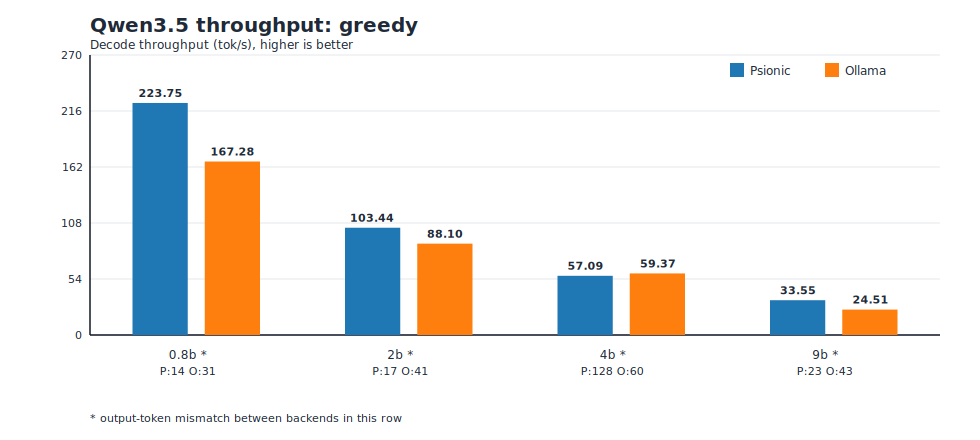
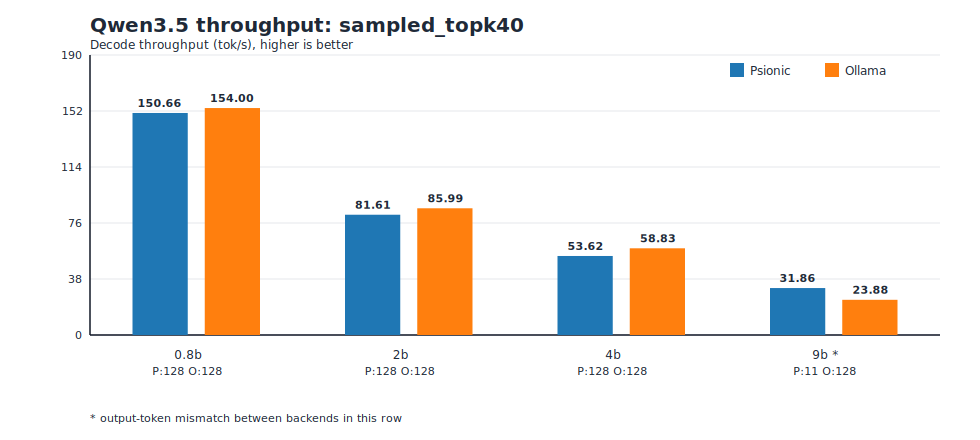
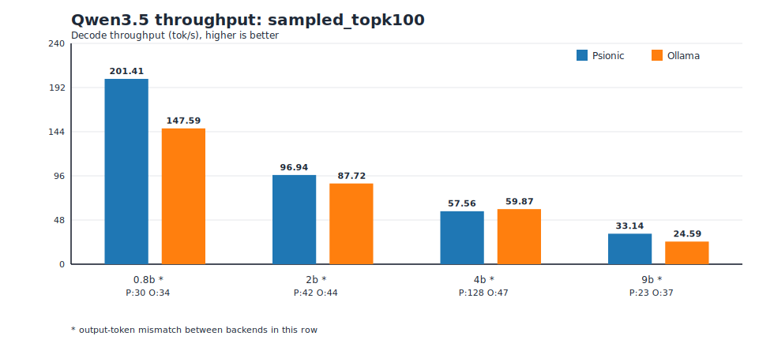
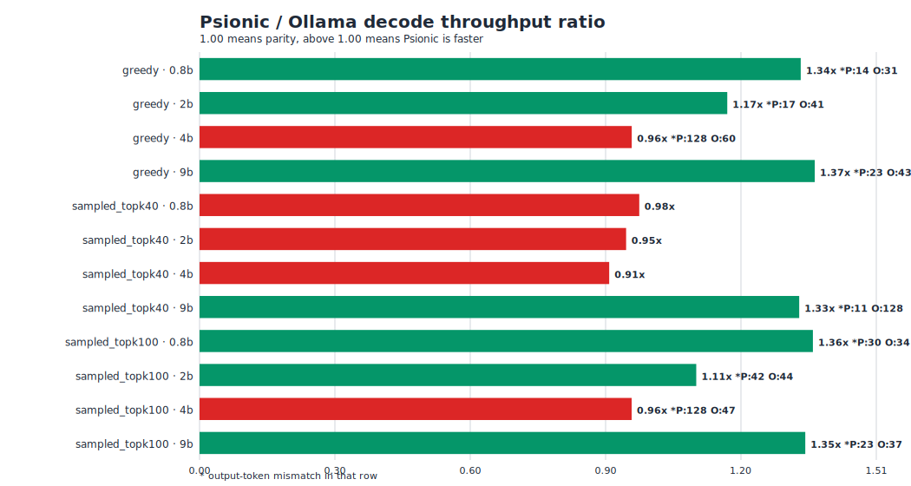

# Qwen3.5 Psionic vs Ollama Benchmark Summary (March 28, 2026)

This one-page summary is generated from:

- `fixtures/qwen35/benchmarks/qwen35_ollama_matrix_20260328_124310_rtx4070_laptop_8gb.json`
- run id: `qwen35_full_benchmark_20260328_124310`
- host: `NVIDIA GeForce RTX 4070 Laptop GPU` (8 GB), current power limit `55W` (max `90W`)
- Psionic benchmark checkout commit: `f91c8844f55312dca5e0c14dd06bd5d11bac89d3`
- Psionic compatibility-fix commit used after this run: `6fe574147b182b4d828b888c68791d82191b7e09`
- Ollama version: `0.17.7`

## Executive Summary

- Psionic is ahead in `7` of `12` rows and behind in `5` of `12` rows on decode throughput.
- This run does not show a clean across-the-board Psionic lead over Ollama.
- The largest quality-comparability issue is `sampled_topk40` on `qwen3.5:9b` (`11` tokens on Psionic vs `128` on Ollama).

## Full Matrix (decode throughput)

| Contract | Model | Psionic tok/s | Ollama tok/s | Psionic/Ollama | Output tokens (P/O) | Note |
| --- | --- | ---: | ---: | ---: | --- | --- |
| `greedy` | `qwen3.5:0.8b` | 223.75 | 167.28 | 1.34x | 14/31 | ahead; token-count mismatch |
| `greedy` | `qwen3.5:2b` | 103.44 | 88.10 | 1.17x | 17/41 | ahead; token-count mismatch |
| `greedy` | `qwen3.5:4b` | 57.09 | 59.37 | 0.96x | 128/60 | behind; token-count mismatch |
| `greedy` | `qwen3.5:9b` | 33.55 | 24.51 | 1.37x | 23/43 | ahead; token-count mismatch |
| `sampled_topk40` | `qwen3.5:0.8b` | 150.66 | 154.00 | 0.98x | 128/128 | behind |
| `sampled_topk40` | `qwen3.5:2b` | 81.61 | 85.99 | 0.95x | 128/128 | behind |
| `sampled_topk40` | `qwen3.5:4b` | 53.62 | 58.83 | 0.91x | 128/128 | behind |
| `sampled_topk40` | `qwen3.5:9b` | 31.86 | 23.88 | 1.33x | 11/128 | ahead; token-count mismatch |
| `sampled_topk100` | `qwen3.5:0.8b` | 201.41 | 147.59 | 1.36x | 30/34 | ahead; token-count mismatch |
| `sampled_topk100` | `qwen3.5:2b` | 96.94 | 87.72 | 1.11x | 42/44 | ahead; token-count mismatch |
| `sampled_topk100` | `qwen3.5:4b` | 57.56 | 59.87 | 0.96x | 128/47 | behind; token-count mismatch |
| `sampled_topk100` | `qwen3.5:9b` | 33.14 | 24.59 | 1.35x | 23/37 | ahead; token-count mismatch |

## Code Changes and Why

- `crates/psionic-backend-cuda/src/kernels/quantized_matvec.cu`:
  added a compile-time include fallback for CUB headers.
- Why: local CUDA header layouts differ across hosts (`cccl/cub/...` vs
  `cub/...`). After reverting earlier agent edits, this fallback was required
  to restore successful CUDA builds without forcing one include layout.
- Effect: no benchmark algorithm change was introduced by this patch; it is a
  portability/compile-compatibility fix so the benchmark runner can execute on
  this machine.
- Benchmark artifact added: `fixtures/qwen35/benchmarks/qwen35_ollama_matrix_20260328_124310_rtx4070_laptop_8gb.json`.
- Report and graph bundle added:
  `fixtures/qwen35/benchmarks/reports/qwen35_ollama_20260328_rtx4070_8gb/`.

## Graphs

### Throughput by contract

### Ratio overview

## Notes

- Rows with output-token mismatches are marked in the table and ratio chart because they are weaker apples-to-apples comparisons.
- All numbers are single-run means (`repeats_per_row = 1`) from this matrix artifact.
